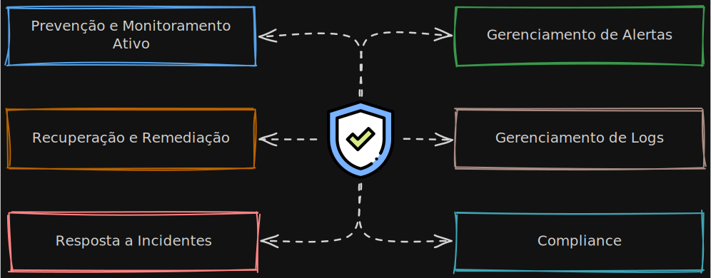
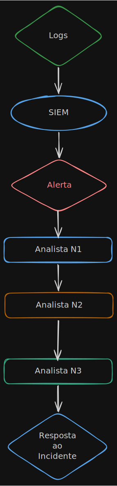

# Introdução ao SOC
## O que é um SOC
O SOC (Security Operations Center, ou Centro de Operações de Segurança) é a central de comando da segurança cibernética de uma empresa. O principal objetivo é monitorar e analisar eventos, ativos e sistemas da empresa, a fim de detectar, analisar e responder a incidentes cibernéticos, outro foco é reduzir o tempo em que a empresa leva para detectar e conter uma ameaça o MTTR (Mean Time To Respond, ou Tempo Médio para Resposta).

	<em>Visão geral de um SOC</em>

## Composição de um SOC
O SOC é composto por diversos profissionais, cada um com sua responsabilidade, afim de otimizar e especializar cada processo que ocorre dentro de um SOC. Segue alguns desses profissionais e seus objetivos dentro de um SOC:

| Função | Objetivo |
| -- | -- |
| Analista SOC N1 | Monitorar alertas, realizar a triagem inicial e escalar incidentes quando necessário. |
| Analista SOC N2 | Receber casos do N1 e investigar e responder a casos de média a alta complexidade. |
| Analista SOC N3 | Receber casos complexos do N2, caçar ameaças e criar detecções e apoiar em atividades de resposta a incidentes. |
| Caçador de Ameaças | Procurar por comportamentos suspeitos, desenvolver consultas avançadas em SIEM e descobrir falhas de cobertura |
| Engenheiro de Segurança | Implementar ferramentas de segurança, configurar SIEM, EDR, SOAR, desenvolver integrações e criar regras de detecção |
| Gerente | Responsável pelo orçamento, elaboração de estratégias e coordenação da equipe e operações. |
---

## Tipos de SOC
Além disso, existem diferentes tipos de SOC, isso varia de empresa para empresa, nível de necessidade de segurança e o mais importante, do orçamento que a empresa tem disponível para área de segurança.

| Tipo | Organização |
| -- | -- |
| In-House | Esse SOC é formado pela empresa e trabalha dentro da própria, dependendo de um orçamento mais alto para manter os analistas, infraestrutura e equipamentos |
| Virtual | O SOC virtual não tem uma instalação fixa, podendo trabalhar de forma remota, podendo ser de uma empresa expecífica, ou trabalhar para uma empresa que presta serviço de segurança para outras |
| Co-Gerenciado | O SOC interno de uma empresa trabalha com um Provedor de Serviços de Segurança Gerenciados (MSSP), que é prestado por outra empresa. |
| Comando | O SOC de comando é um time que supervisiona SOCs menores |
---

## Ferramentas
O SOC trabalha com ferramentas, existem diversas delas no mercado, cada um com abrangências diferentes e níveis de complexidades, além de custos. Abaixo uma lista das principais ferramentas usadas em um SOC e o que ela faz.

| Nome | Função | Exemplo |
|--|--|--|
| SIEM | Centraliza logs de diversas fontes como, firewalls, servidores, e-mails, correlaciona eventos e gera alertas de segurança. | Microsoft Sentinel, Splunk, IBM QRadar, Elastic Security |
| EDR | Monitoramento profundo de dispositivos, é possível ver processos em execução, comandos executados, arquivos criados, etc. | Microsoft Defender for Endpoint, CrowdStrike, SentinelOne, Sophos Intercept X |
| SOAR | Automatizar tarefas como: Receber alertas e fazer verificações de domínio, consultas no VirusTotal, bloqueio de url e até abertura de tickets | Cortex XSOAR, Splunk SOAR, Microsoft Sentinel|
| IDS/IPS | Detectar ataques na rede, o IDS apenas cria alertas, o IPS cria alertas e bloqueios | Snort, Suricata |
| Firewall | Controla o tráfego da rede usando regras para permitir ou bloquear acessos | FortiGate, Palo Alto Networks, pfSense |
| Threat Intelligence | Serviços que catalogam indicadores de comprometimento (IOCs), como IPs, domínios, URLs e hash maliciosos | VirusTotal, AbuseIPDB, AlienVault OTX |
---

Cada tipo de ferramenta dessa será estudado e tratado a parte, em sua própria página.

## Fluxo básico de um SOC

	<em>Fluxo básico de funcionamento de um SOC.</em>

## Conceitos importantes

### MTTR
Mean Time To Respond (Tempo médio de resposta)

Tempo médio que a equipe leva para responder a um incidente.

### IOC
Indicator of Compromise (Indicador de Comprometimento)

Evidência de possível atividade maliciosa.

## Referências
* https://app.letsdefend.io/path/soc-analyst-learning-path
* https://www.ibm.com/br-pt/think/topics/security-operations-center
* https://www.microsoft.com/pt-br/security/business/security-101/what-is-a-security-operations-center-soc
* https://www.paloaltonetworks.com.br/cyberpedia/what-is-a-soc
