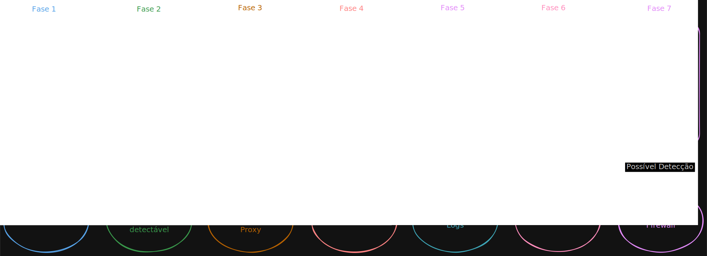

# Introdução Ao Cyber Kill Chain
## O que é o Cyber Kill Chain
A Cyber Kill Chain (Cadeia de Eliminação Cibernética) desenvolvida pela Lockheed Martin, é um framework baseado em um conceito militar, onde para atingir um objetivo, o atacante precisa passar por uma sequência de fases estruturadas. Conhecendo as fases, é possível ter uma visão de onde e como intervir para fazer o ataque falhar. A seguir as 7 fases do Cyber Kill Chain.

### Fase 1 - Reconhecimento (Reconnaissance)
Nessa fase, é onde o atacante coleta informações do alvo, podendo ser uma busca passiva como buscas no linkedin para encontrar funcionários, mineração de dados públicos (onde se pode encontrar endereços de email, telefones, etc.) ou uma busca ativa, como um port scanning para buscar portas abertas em servidores.

A busca passiva, normalmente não é detectada dentro pelos SOC, justamente por não necessáriamente buscar em entidades que são protegidas pelo mesmo, como busca pelo linkedin ou busca por informações do domínio da empresa. Porém, o ativo costuma aparecer em logs de Firewall, IPS/IDS, como centenas de conexões vindas de um mesmo IP em poucos segundos tentando acessar portas variadas (o famoso port scanning).

### Fase 2 - Armamento (Weaponization)
Ao finalizar o reconhecimento, o atacante define a forma como vai ocorrer o ataque. É aqui que os malwares ou exploits são construidos e vinculados ao meio de entrega, como por exemplo, um PDF, ZIP ou um link malicioso que parece ser legítimo.

Como essa fase ocorre fora da rede da empresa, não é possível gerar alertas nessa fase. O que se pode fazer é mapear e se inteirar sobre novas ferarmentas os atacantes estão criando para preparar seu ambiente para suportar.

### Fase 3 - Entrega (Delivery)
Após o armamento está finalizado, chegou a hora de transmitir o malware para o alvo. Normalmente, os caminhos mais comuns são: emails (phishing com anexos ou links maliciosos), sites comprometidos (drive-by download) ou até mesmo pendrives infectados deixados em lugares próximos ao alvo.

Aqui, os alertas são gerados pelo gateway de email corporativo (como um email bloqueado por conter um anexo executável), logs de Proxy ou Firewall barrando o acesso a um site categorizado como malicioso.

### Fase 4 - Exploração (Exploitation)
Aqui o malware foi entregue e agora é executado, normalmente eles exploram vulnerabilidades no sistema operacional ou em softwares como navegador, pacote office, etc. mas pode ocorrer do próprio usuário clicar em um botão dentro de um documento falso e startar a execução.

Nessa fase, o EDR irá mostrar comportamentos suspeitos, como um processo do word gerando um processo filho executando um cmd ou powershell.

### Fase 5 - Instalação (Installation)
Depois que o malware é executado, o atacante precisa garantir a persistência de sua execução, caso a máquina seja reiniciada, o malware deve ser executado logo após a inicialização, assim o atacante mantem acesso. Normalmente é usado um Cavalo de Troia, Backdoor ou Web Shell.

Aqui, o EDR ou logs do windows vão alertar sobre a criação de um novo serviço de sistema suspeito, ou a modificação de chaves de registro de inicialização do sistema.

### Fase 6 - Comando e Controle (C2)
Nessa fase, depois de garantir a persistência, o malware abre um canal de comunicação com o ambiente externo controlado pelo atacante, através desse canal, o atacante consegue disparar comandos para máquina infectada.

Nos logs de rede (Firewall/DNS) será possível ver conexões recorrentes (conhecidas como beacons) de um IP interno para um IP externo suspeito ou com domínio desconhecido. Devemos ficar atento com conexões a portas não padrão ou tráfego criptografado suspeito saindo da rede.

### Fase 7 - Ações nos Objetivos (Actions on Objective)
O atacante agora tem controle ao sistema e vai cumprir seu objetivo, que pode ser Exfiltração de dados confidenciais (o famoso vazamento de dados), destruir logs para cobrir os rastros, acionar um Ransomware (criptografar todos os servidores).

Aqui, será possível ver um pico massivo de tráfego de upload (exfiltração de dados), logs de EDR mostrando a deleção massiva de Shadow Copies do Windows, ou centenas de arquivos mudando de extensão em um servidor de arquivos.

## Fluxo básico do Cyber Kill Chain

	<em>Fluxo básico de funcionamento do Cyber Kill Chain.</em>

## Falso Positivo vs Verdadeiro Positivo
Devemos tomar cuidado para não confundir ferramentas legítimas de administração com ataques na fase de Exploração/Instalação.

* **Falso Positivo Comum**: Um alerta de "Execução de script PowerShell suspeito", executado na máquina de um analista de infraestrutura. Ele estava apenas automatizando uma tarefa de rotina.
* **Verdadeiro Positivo**: O mesmo script PowerShell executando de madrugada, na máquina de um funcionário do setor de Recursos Humanos originado de um processo do Adobe Reader.

## Pontos importantes
A Cyber Kill Chain é uma visão linear, ataques modernos muitas das vezes "pulam" etapas, por isso a Kill Chain deve ser usada como um mapa mental de progressão, pois os atacantes podem ser mais dinâmicos.

Hoje o mercado utiliza muito o framework MITRE ATT&CK que conta com uma matriz de técnicas e táticas altamente detalhado.

## Referências
* https://app.letsdefend.io/path/soc-analyst-learning-path
* https://www.lockheedmartin.com/en-us/capabilities/cyber/cyber-kill-chain.html
* https://www.trendmicro.com/pt_br/what-is/cyber-attack/cyber-kill-chain.html

---
Criado em 03/06/2026

Atualizado em 03/06/2026