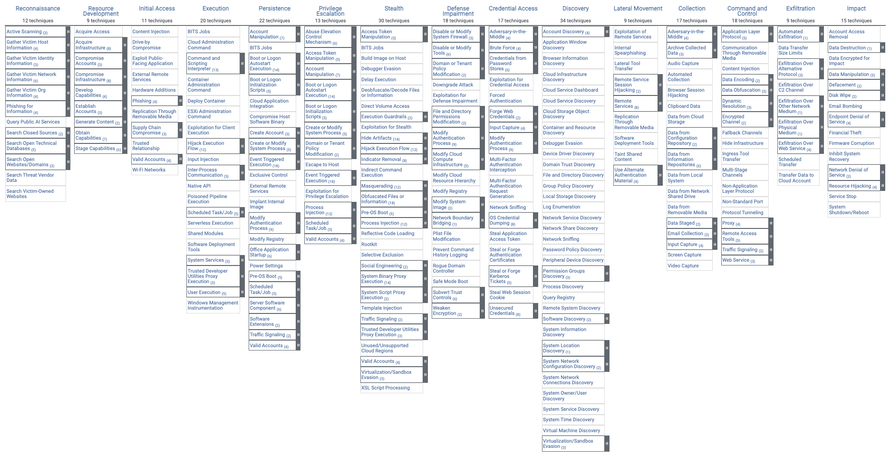

# Introdução ao MITRE ATT&CK
## O que é o MITRE ATT&CK
MITRE ATT&CK é um framework criado com base na observação de ataques reais no mundo inteiro. Enquanto o Cyber Kill Chain tem uma visão linear e macro do ataque, o MITRE ATT&CK funciona como uma enciclopédia que detalha exatamento como o atacante age. A sigla ATT&CK significa Adversarial Tactics, Techniques, and Common Knowledge (Táticas, Técnicas e Conhecimento Comum de Adversários). Ela é separada em Matrizes (Enterprise, Mobile e ICS), cada matriz é específica, e aqui irei focar na Enterprise. Elas quebram as ações dos atacantes em três níveis principais que serão descritas a seguir.

## Táticas (O "Porquê")
A tática busca entender o objetivo do atacante naquele momento. Atualmente o MITRE ATT&CK tem 14 táticas:

| # | Tática | O que significa | Exemplo Prático |
|--|--|--|--|
|1| Reconnaissance | Coleta de informações sobre o alvo | Varreduras de portas (port scan)|
|2|Resource Development | Criação de infraestrutura (IPs, domínios, malwares) | Compara um domínio parecido com o da empresa para Phishing |
|3|Initial Access | Como o atacante entra na rede | Funcionário executa um anexo malicioso ou vaza uma senha de VPN |
|4| Execution | Rodar o código malicioso no sistema | O malware abre um terminal (power shell) para rodar comandos |
|5| Persistence | Manter o acesso mesmo se a máquina reiniciar | Criar um serviço malicioso no Windows ou um script no cron do linux |
|6| Privilege Escalation | Ganhar permissões mais altas (Admin ou Root) | Explorar uma vulnerabilidade de kernel para sair de usuário comum para um com mais privilégios |
|7| Defense Evasion | Evitar ser detectado pelas ferramentas de segurança | Desativar o Windows Defender ou apagar logs de eventos do sistema |
|8| Credential Access | Roubar nomes de usuários e senhas | Fazer dump da memória para pegar hashes de senhas |
|9| Discovery | Entender o ambiente onde ele está (mapear a rede) | Executar comandos como whoami, net view ou ipconfig /all |
|10| Lateral Movement | Mover de uma máquina para outra na rede | Usar RDP (Acesso Remoto) ou SSH para acessar o servidor usando as senhas roubadas |
|11| Collection | Reunir os dados de interesse para o roubo | Compactar pastas de documentos confidenciais em um arquivo .zip|
|12| Command and Control | Comunicar com a máquina infectada de fora da rede | Tráfego HTTP ou requisições DNS periódicas para o IP do atacante|
|13| Exfiltration | Roubar dados | Fazer upload do arquivo .zip para armazenamento pessoal do atacante|
|14| Impact | Destruir, criptografar ou interromper as operações | Execução de um Ransomware que criptografa o servidor ou apaga o banco de dados|
---

	<em>Táticas do MITTRE ATT&CK.</em>

## Técnicas (O "Como")
É a forma específica como o atacante alcança o objetivo da tática. Dentro do MITRE ATT&CK existem diversas técnicas, as mesmas podem ser encontradas no site oficial.

Vamos tomar como exemplo a T1566 (Phishing), dentro dela, temos a explicação do que é essa técnica, além de exemplos.

## Subtécnicas (O "Detalhe")
É a técnica mais específica usada pelo atacante.

Por exemplo, a T1566 (Phishing) atualmente tem 4 subtécnicas (T1566.001, T1566.002, T1566.003 e T1566.004), o 001 trata de anexos maliciosos, o 002 de links maliciosos, o 003 trata de envio de mensagem via serviços terceiros e o 004 trata de comunicação de voz.

Nem toda técnica tem subtécnicas, mas a maioria delas tem. Em um estudo futuro irei aprofundar mais nessas técnicas e subtécnicas.

## Como ler um ID MITRE
Cada técnica possui um identificador único.

Exemplos:

- T1566 → Phishing
- T1059 → Command and Scripting Interpreter
- T1078 → Valid Accounts

Quando existe uma subtécnica, um sufixo é adicionado:

- T1566.001 → Spearphishing Attachment
- T1566.002 → Spearphishing Link

Esses identificadores são amplamente utilizados em relatórios, alertas e investigações de segurança.

## Como o MITRE ATT&CK é usado em um SOC
O MITRE ATT&CK é amplamente utilizado para:

* Classificar alertas de segurança
* Mapear técnicas utilizadas por atacantes
* Criar regras de detecção
* Realizar Threat Hunting
* Avaliar cobertura de ferramentas de segurança
* Conduzir exercícios de Red Team e Purple Team

Muitos SIEMs e EDRs modernos já associam alertas diretamente a técnicas MITRE ATT&CK.

## Referências
* https://app.letsdefend.io/path/soc-analyst-learning-path
* https://attack.mitre.org/matrices/enterprise/
* https://attack.mitre.org/techniques/T1566/
* https://attack.mitre.org/techniques/T1566/001/
* https://attack.mitre.org/techniques/T1566/002/
* https://attack.mitre.org/techniques/T1566/003/
* https://attack.mitre.org/techniques/T1566/004/
---

Criado em 04/06/2026

Atualizado em 04/06/2026