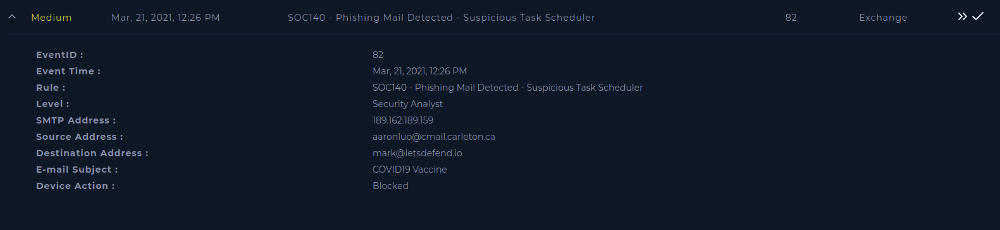
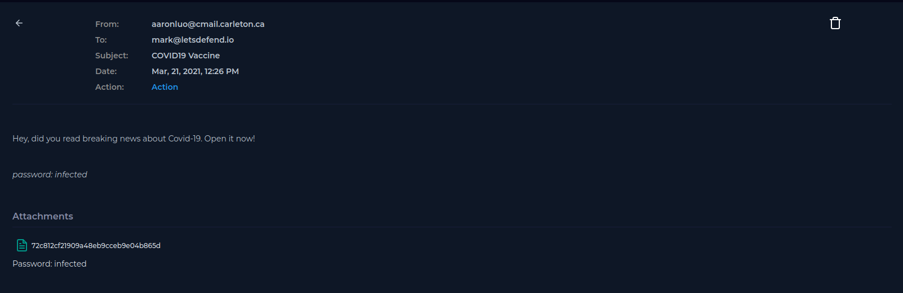
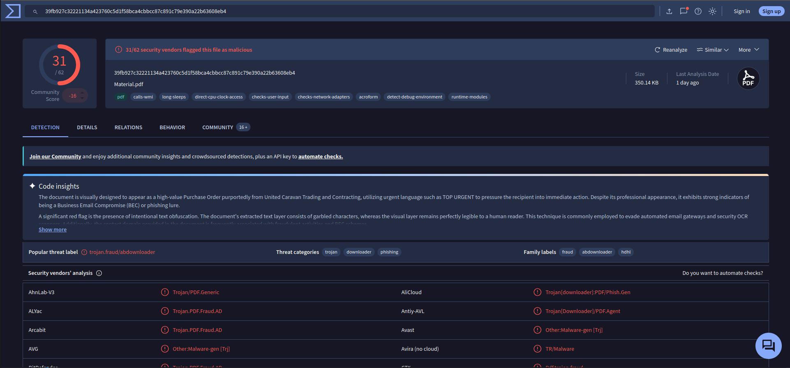

# SOC140 — Phishing Mail Detected - Lets Defend
## Alerta
É possível ver que o email não foi entregue ao destinatário, pois o mesmo consta como entrega bloqueada.

## Ações
#### Verificação do Email
É possível ver que o email tem um anexo com uma senha para acessa-lo.

#### Verificação da url no Virus Total
https://www.virustotal.com/gui/file/39fb927c32221134a423760c5d1f58bca4cbbcc87c891c79e390a22b63608eb4

## Conclusões
O email contém em anexo um arquivo suspeito com senha para acessa-lo, o que faz com que alguns serviços não consigam validar o conteúdo, tornando-o mais suspeito. Além disso, podemos verificar que no siste Virus Total o mesmo foi classificado como arquivo malicioso.

Como o email não foi entregue, o mesmo não foi acessado e o arquivo não foi baixado. Logo foi apenas removido o email.

## Playbook
1 - Há Arquivo ou URL anexado

2 - Arquivo malicioso verificado no VirusTotal

3 - Email não entregue

4 - Alerta verdadeiro positivo