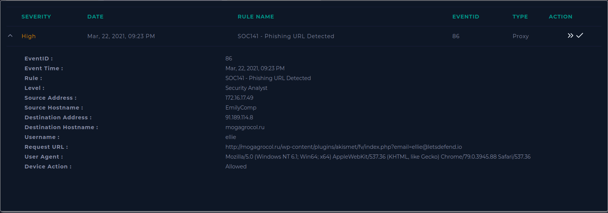
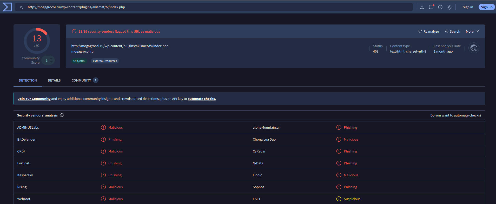
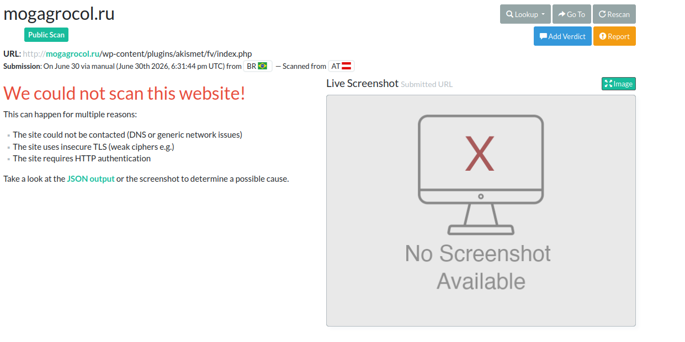
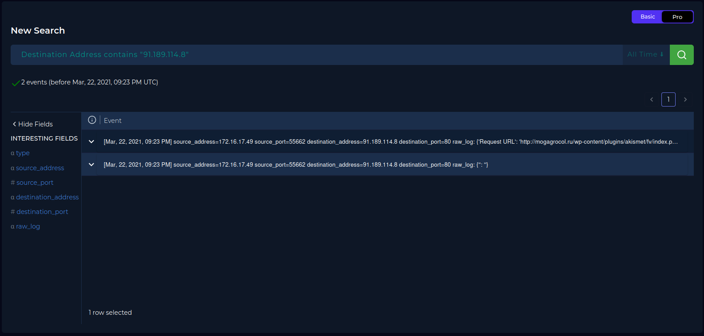
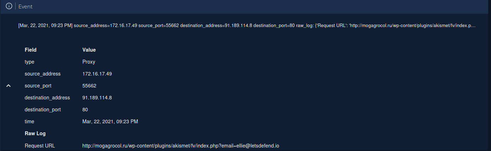
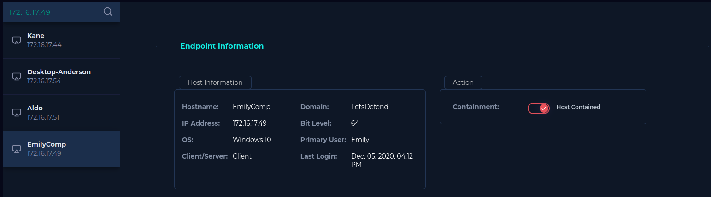

# SOC141 - Phishing URL Detected - Lets Defend
## Alerta

## Ações
#### Verificação da url no Virus Total
https://www.virustotal.com/gui/url/d0da32cbd01eba6a19108c1255cb28411fcd6ded0c42da22ad4f412d8d31112a

#### Verificação da url no urlscan
https://urlscan.io/result/019f19cd-2bff-7308-8d69-b0ca3f0d1b49/

## Conclusões
A url em questão não está mais online, de qualquer forma, houve uma solicitação HTTP para o endereço passando um endereço de email.

Analisando os logs, podemos confirmar que essa solicitação foi bem sucedida. Logo a tentativa de phishing ocorreu e precisamos conter a máquina.

## Playbook
1 - Link malicioso

2 - Requisição efetuada com sucesso (Conteúdo acessado)

3 - Alerta verdadeiro positivo