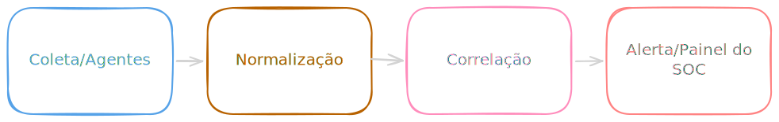

# Introdução ao SIEM

O SIEM é uma plataforma centralizada que coleta logs de toda a infraestrutura corporativa, normaliza esses dados para padronizar, correlaciona eventos suspeitos e alerta os analistas sobre possíveis ameaças em tempo real.
Sem ele, a equipe de segurança precisaria logar manualmente em centenas de servidores e sistemas diferentes toda vez que quisesse investigar um incidente. Com o SIEM, tudo se converge para uma única tela.

A sigla vem de duas frentes que hoje atuam juntas:

- SIM (Security Information Management): Responsável por coletar, armazenar e organizar os logs a longo prazo.
- SEM (Security Event Management): Responsável por analisar os eventos enquanto eles acontecem, correlaciona os dados e dispara alertas para o SOC.

## Ciclo de Vida do Dado no SIEM

Para que o SIEM funcione corretamente, o dado deve passar por um fluxo bem definido:

1 - Coleta (Ingestion): O SIEM recebe logs de Firewalls, Servidores Windows/Linux, Active Directory, Banco de Dados, Cloud (AWS, Azure, etc.), EDRs... Isso é feito por agentes instalados nas máquinas ou por protocolos de rede (como Syslog e WinRM).

2 - Normalização (Parsing): Cada fabricante escreve logs de um jeito. O Firewall da Checkpoint registra um bloquei de um jeito, o Palo Alto de outro. O SIEM traduz tudo para um padrão universal (ex: transforma campos variados como src_ip, source, src em apenas um campo padrão: source_ip).

3 - Correlação (Correlation): O SIEM aplica regras lógicas cruzando dados de fontes totalmente diferentes.

4 - Armazenamento (Retention): Os logs ficam guardados (indexados) para que possa ser buscados de forma rápida (Threat Hunting) ou auditorias de incidentes que aconteceram meses atrás.

## Regras de Correlação

Uma regra de correlação liga pontos que um analista humano demoraria horas para perceber.

- Cenário Isolado A: O log do Firewall mostra um IP da Romênia tentando conectar no servidor web da empresa. (Raciocínio: Pode ser apenas um ruido de escaneamento automático).

- Cenário Isolado B: O log do Active Directory mostra um erro de login de um usuário do financeiro. (Racionínio: O usuário deve ter errado a senha).

- A Regra do SIEM: Se um IP externo falhar 5 vezes o login no Firewall e na tentativa 6 houver um login com sucesso no Active Directory usando a conta de um usuário que nunca logou da Romênia, dispare o alerta "Possível Comprometimento de Conta/Brute force realizado com Sucesso".

## SIEMs Modernos

Os SIEMs tradicionais dependiam 100% de regras estáticas (se acontecer X + Y, faça Z). Os SIEMs modernos evoluiram muito:

- UEBA (User and Entity Behavior Analytics): Em vez de regras fixas, o SIEM usa aprendizado de máquina para entender o comportamento normal da empresa. Se a Maria (do RH) sempre loga de segunda a sexta, das 8h às 18h e de repente a conta dela faz um download de 50GB de dados as 3h da manhã, o UEBA gera um alerta de anomalia, mesmo que seja ela acessando, pois o comportamento é atípico.

- Integração nativa com SOAR: O SIEM moderno não apenas avisa o analista, mas já engatilha o playbook de automação (SOAR) para bloquear ameaça instantaneamente.

## Os Maiores Players do Mercado

- Splunk Enterprise Security: Um dos lideres de mercado, extremamente poderoso para busca massivas (usa a linguagem SPL).

- Microsoft Sentinel: Um SIEM/SOAR nativo de nuvem (Cloud-Native), fortíssimo em ambientes Azure/Office 365 (usa linguagem KQL).

- Elastic Security (ELK): Muito popular pela flexibilidade e comunidade, escalável e open-source em sua base

- IBM QRadar / ArcSight: Gigantes tradicionas do mercado corporativo e de grandes MSSPs.

- Wazuh: O principal player do ecossistema Open-Source. É uma plataforma híbrida de XDR e SIEM que se destaca no mercado de pequenas/médias empresas e Home Labs por possuir um agente multifuncional poderoso (capaz de fazer monitoramento de integridade de arquivos, detecção de vulnerabilidades e resposta ativa).

## Referências
* https://app.letsdefend.io/path/soc-analyst-learning-path
* https://www.microsoft.com/pt-br/security/business/security-101/what-is-siem
* https://www.ibm.com/br-pt/think/topics/siem
* https://www.trendmicro.com/pt_br/what-is/security-operations/security-information-and-event-management.html
---

Criado em 06/07/2026

Atualizado em 06/07/2026